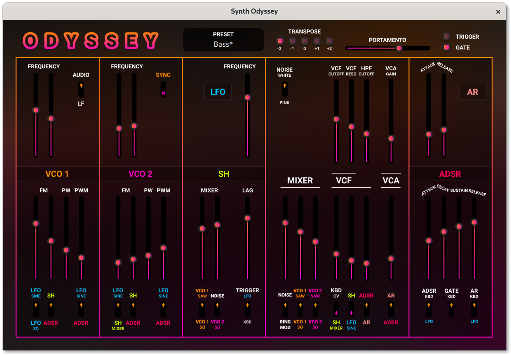

# Synth: Odyssey

Digital homage to the ARP Odyssey synthesizer.

## Building

The project is built using CMake and is split into independent libraries.

### Submodule dependencies

On Fedora Linux, install the following dependencies:

| Module | Dependencies |
| Alsa | alsa-lib-devel |
| Imgui | glfw-devel |
| Qt | qt5-devel |
